# Rork Instagram Feed アプリ ワイヤーフレーム

## 全体構造

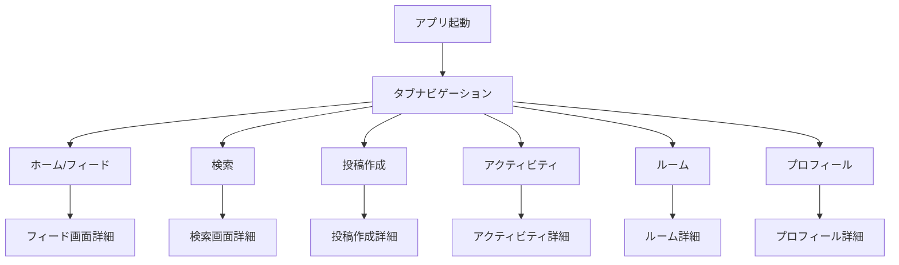

## 1. ホーム/フィード画面 (index.tsx)

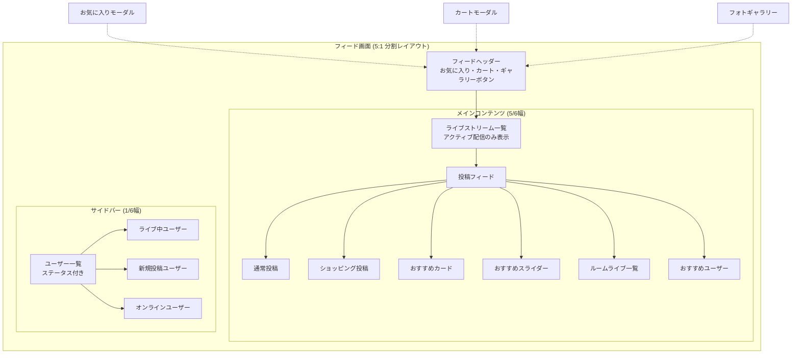

## 2. 検索画面 (search.tsx)

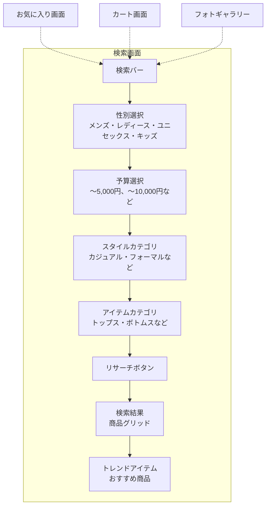

## 3. 投稿作成画面 (create.tsx)

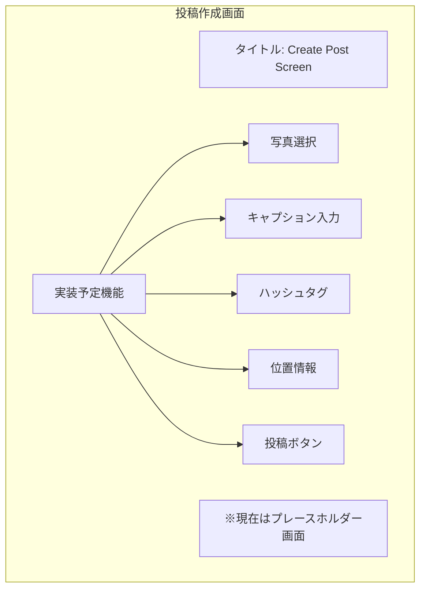

## 4. アクティビティ画面 (activity.tsx)

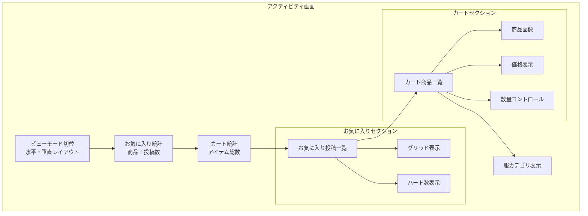

## 5. ルーム画面 (room.tsx)

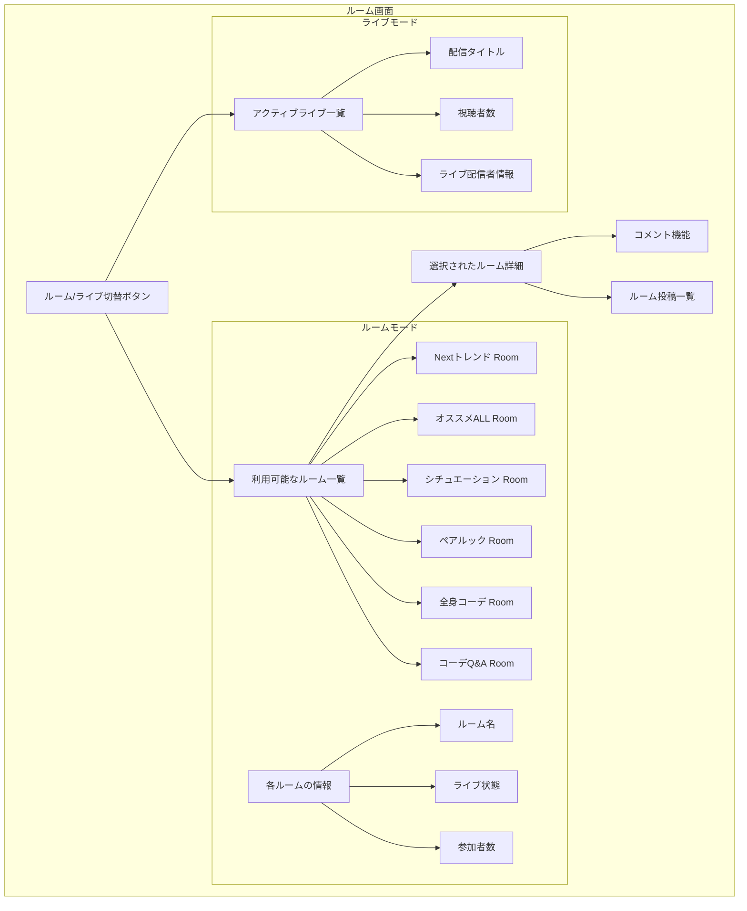

## 6. プロフィール画面 (profile.tsx)

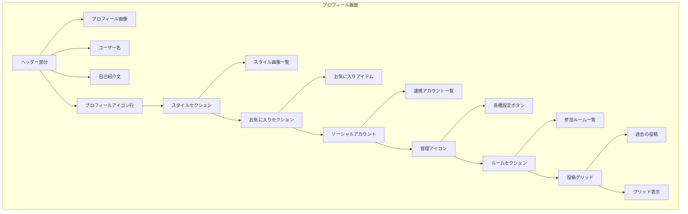

## タブナビゲーション構造

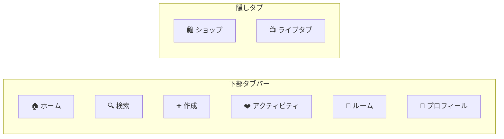

## モーダル・詳細画面の関係

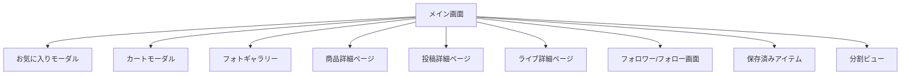

## 主要機能フロー

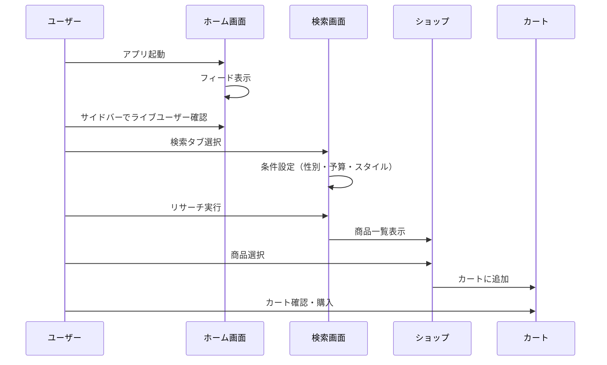

## データ構造と状態管理

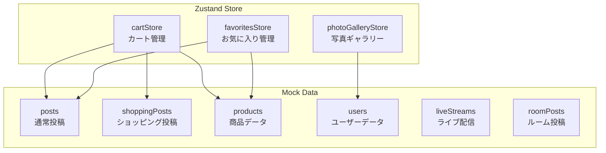

## 画面サイズとレイアウト

```mermaid
graph TB
    subgraph "レスポンシブ設計"
        A[画面幅: window.width]
        A --> B[メインコンテンツ: 5/6 幅]
        A --> C[サイドバー: 1/6 幅]
        
        subgraph "カード設計"
            D[カード幅: (メイン幅 / 2) - 24px]
            E[カード高さ: カード幅 * 0.8]
        end
        
        subgraph "安全エリア対応"
            F[上部: useSafeAreaInsets]
            G[下部: タブバー + insets.bottom]
        end
    end
```